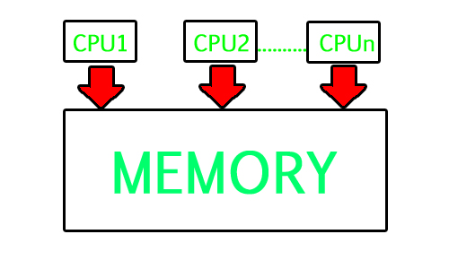

# Introduction to Operating Systems

- Operating System is a software that takes control of your machine after it s turned on. Some basic power on test happens then the control is given to the operating system and it becomes in-charge of your machine.

- All the programs we run , we need to go to operating system to get it done , so operating system is manager or it is an interface which we use to interact with the machine.

- So Users do not have to interact with the hardware, they give commands to the OS.

- So OS acts as an interface between your application and hardware.

## Pictorial Representation of OS Interface:

```text
            USER
                |
            Application (chrome , word, Processor)
                |
            Operating System(Linux, Windows)
                |
            Hardware(CPU, Memory , HDD)
```

## Services (Requirement of OS) -

- Resource Management : We need a manager to decide which process should be using the CPU first and which process should be loaded in the Ram and which should be removed.
- Abstraction : OS has system calls to read a data from hard disk or store the data on hard disk.
- Protection : Protecting apps from each other and avoiding malware to enter the system.

## Examples of OS-

- Desktop : Windows,Linux,MacOS.
- Mobile : Android,IOS.

## Types of Operating Systems(based on functionality)-

- Single Tasking
- MultiProgramming and Multitasking
- Multithreading
- Multiprocessing

### Single Tasking OS -

- These OS are very simple operating systems are very basic they do not provide multiple functionalities.

- They allow only one process to be in the ram and run in the ram

- Eg: MS-DOS

- Inefficient - Because I/O devices are very slow compared to CPU. So if a process is in the memory and has started executing and it starts doing I/O then CPU is idle for those milliseconds which is very inefficient.

```text
Note : When we want to run something in our computer , this has to be broguht into the memory , your CPU can only talk to the processes which are there in the memory. So whenever we want to run anything this has to be brought in to the main memory where it becomes a process and then it can be executed by the CPU.
```

### MultiProgramming and Multitasking OS -

- In Multitasking OS when we start  I/O in a process then we take that process out of the CPU and assign some other process to the CPU.

- In Multiprogramming, the processes are assigned smartly to the CPU and if any process stops then other process is assigned to the CPU , this can be according to the priority as well.

- What is the difference between multi-programming and multitasking?

- In  multi-programming, we can have multiple processes in the memory and can execute them in a interleaved fashion.

- In multitasking, it is an extension to multiprogramming, we have particular time slot assigned to each processes and once time assigned is completed then we move to the next process. It is more responsive in nature.

### Multithreading OS -

- In Multithreading , we have multiple threads running in process in interleaved fashion.

- In OS, we have multiple processes running in interleaved fashion.

- It is more responsive in nature , also uses CPU efficiently.

- For eg: we are viewing a playlist and at the same time we can change the playlist and next song is scheduled. So all things happen concurrent manner.

- So multithreading is interleaving within the process. A thread is smallest unit of execution which can be assigned to the CPU, they are smaller than process. One process can have one or multiple  threads.

- Another Advantage of multithreading is : Switching from one thread to another is less costly as compared to switching between the processes.

- Thread do not require process switch.

- Eg: Windows, Linux , MaxOS.(Linux implements the Posix threads which is the standard thread library for multithreading).

### Multiprocessing OS -

- We can have multiple processors in a system, To manage all the processors we use multiprocessing OS.

- All desktops have support of multiple processors.

### Multiuser OS -

- Earlier we could have only once user at a time but now we can have multi users and all desktop OS provide multi user support.

-----------

# Article 

## What is an operating system?

- An operating system acts as an intermediary between the user of a computer and computer hardware. The purpose of an operating system is to provide an environment in which a user can execute programs in a convenient and efficient manner. Besides that, an OS is responsible for the proper management of the system's resources (Memory, CPU, I/O devices, Files, etc.) to the various user tasks.
- Based on various use-cases, different types of OS have been developed:
- Batch OS
- Time-sharing OS
- Distributed OS
- Network OS
- Real-time OS

Each of the above mentioned is discussed in brief below:

## Batch Operating System

- In a batch OS, there is an operating program that groups the jobs into batches based on similar requirements. There is no manual intervention or pre-emption between batches. Usage: Payroll System, Bank statements etc.


- Some of the key points of a Batch OS are:
- Multiple users can assign jobs (operator program manages them into batches).
- Completion Time of a Job is unknown.
- No idle time for the CPU
- Convoy Effect can occur (Bottleneck for waiting jobs if current job is taking too much time).

## Time-Sharing Operating System

- Multiple users can concurrently interact with the system. Each user is allocated a time quantum (chunk) for execution, after which the OS context-switches to another user. This maintains the responsiveness of the OS. e.g., Multix, Unix etc.

- Some of the key points of a Time-Sharing OS are:
- Each user gets an equal opportunity.
- No user has to wait indefinitely if some other is stuck (due to context-switch).
- Switching Time is an extra overhead.

## Distributed Operating System

- A distributed OS consists of multiple hardware units (independent CPU, Memory, I/O Units), with a single OS managing execution of processes in those various independent hardware systems. They are thus also known as loosely coupled systems. The major benefit of working with these types of an operating system is that it is always possible that one user can access the files or software which are not actually present on his system but on some other system connected within this network i.e., remote access is enabled within the devices connected in that network.


- Some of the key points of a distributed OS are:
- Failure of one will not affect the other.
- Computation is fast (as resources are shared & parallel execution is possible)
- Easily Scalable (add more hardware units)

## Network Operating System

- These systems run on a server and provide the capability to manage data, users, groups, security, applications, and other networking functions. All the users should be well aware of the underlying configuration, of all other users within the network, their individual connections etc. and that’s why these computers are popularly known as tightly coupled systems. Usage e.g. Microsoft Windows Server, Ubuntu Server, CentOS etc.

- Some of the key points of a Network OS are:
- Centralized System (vulnerable to failure)
- Remotely Accessible from different location and types of systems
- New upgradations are easily done (1 central system)

## Real-time Operating System

- They are OS meant to handle mission-critical tasks. They have high responsiveness and fast processing time. The functionalities are limited and specific to the domain. e.g., Defense Systems, Robots, WSNs, Air-Traffic Control, Space Rovers systems.

- Some of the key points of a real-time OS are:
- Maximum Utilization & 0 downtime (can't afford to go down)
- Application-Specific
- Error-free and automatic recoverable systems

## Multiprogramming, Multiprocessing & Multithreading

- Although the 3 words seem similar (and they do in some respect ~ concurrency), however, there are subtle differences amongst all 3 of them:
Multiprocessing: True parallelism is achieved via Multiprocessing as there physically exists multiple hardware units (CPU, cache, and even Memory) amongst which programs are shared. Thus, at a time, parallel execution is possible.

Multiprocessing aided systems have an added advantage of failure-tolerance. i.e. Even if one CPU fails, the system can keep running relying upon the other processors. Also, one can gain significant gains in computation by horizontally scaling the system (using multiple mediocre CPUs instead of upgrading the single one). I/O and peripheral devices can be shared amongst the units thus saving total expense.

Multiprogramming: Multiple programs share single hardware resources. However, fake parallelism is achieved by context-switching between the processes. Responsiveness between multiple programs is achieved in this manner. The number of programs that can simultaneously run thus depends upon the size of the main memory.

In such a system, all the programs are placed in a queue for execution (also called job pool). The scheduler picks jobs one-by-one and executes till the time quantum expires, or the process is pre-empted by some external factors (I/O requirement, interrupt, etc.). In such a case, the process is context-switched with the next one, thus preventing the CPU from being idle.

Multithreading: Multiple Threads running as part of the same process. Threads have common shared resources (memory, file descriptors, code segment, etc.). However, they have independent stack-space, program-counters, etc.

Threads are said to be lightweight processes, which run together in the same context. They also get context-switched; however, the delay is much lesser compared to the whole process being switched. The reason being threads share the same PCB (Process-control-block, which will be covered later) e.g., tabs in a web-browser is a good example of threads (each tab shares the same browser process, but has its own separate identity).
